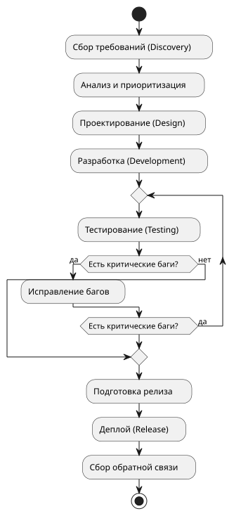
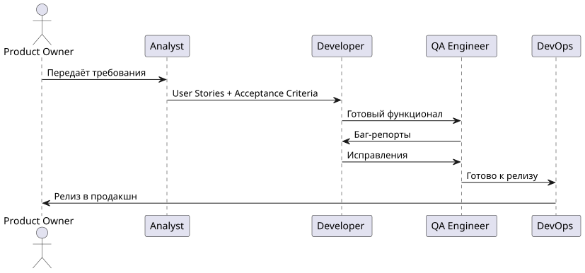

# Software Development Process Documentation

Документирование процесса разработки программного обеспечения с использованием BPMN и PlantUML.

Проект показывает умение анализировать процессы, описывать их структурировано и визуализировать с помощью современных инструментов.

---

## Цель проекта

Создать понятное и структурированное описание типичного процесса разработки ПО (от идеи до релиза), которое можно использовать как шаблон в реальных проектах.

## Что внутри

- Описание процесса на русском и английском
- BPMN-диаграмма процесса
- PlantUML-диаграммы (Activity + Sequence)
- Разбивка по ролям и этапам
- Рекомендации по улучшению процесса

## Этапы процесса

| Этап                    | Описание                                      | Основные артефакты              |
|-------------------------|-----------------------------------------------|---------------------------------|
| 1. Discovery            | Сбор требований и понимание задачи            | User Stories, Requirements      |
| 2. Design               | Проектирование архитектуры и интерфейсов      | Architecture Diagram, Mockups   |
| 3. Development          | Написание кода                                | Source Code, Pull Requests      |
| 4. Testing              | Проверка качества                             | Test Cases, Bug Reports         |
| 5. Release              | Подготовка и выпуск версии                    | Release Notes, Deploy           |
| 6. Feedback & Improve   | Сбор обратной связи и улучшение               | Retrospectives, Metrics         |

## Диаграммы

### Activity Diagram (Процесс разработки)

### Sequence Diagram (Взаимодействие ролей)

## Роли в процессе

- **Product Owner** — определяет приоритеты
- **Analyst** — описывает требования
- **Developer** — пишет код
- **QA Engineer** — проверяет качество
- **DevOps** — отвечает за деплой

## Автор

**Matvey Kuzovkin**  
17 лет, Уфа  
Готовлюсь к поступлению в Турцию на Computer Engineering

- Telegram: [@ya_moy](https://t.me/ya_moy)
- GitHub: [matvey-kuzovkin](https://github.com/matvey-kuzovkin)
- Portfolio: [matvey-kuzovkin.github.io](https://matvey-kuzovkin.github.io)

---

# Software Development Process Documentation (English)

Documentation of a software development process using BPMN and PlantUML.

This project demonstrates the ability to analyze processes, describe them clearly, and visualize them using modern tools.

## Project Goal

Create a clear and structured description of a typical software development process (from idea to release) that can be used as a template in real projects.

## What's inside

- Process description in Russian and English
- BPMN diagram
- PlantUML diagrams (Activity + Sequence)
- Breakdown by roles and stages
- Recommendations for process improvement

## Author

**Matvey Kuzovkin**  
17 y.o. from Ufa, Russia  
Preparing to study Computer Engineering in Turkey
